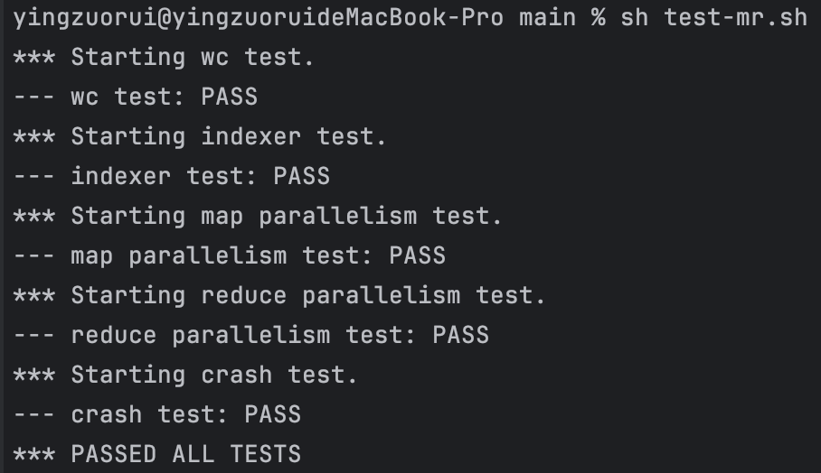
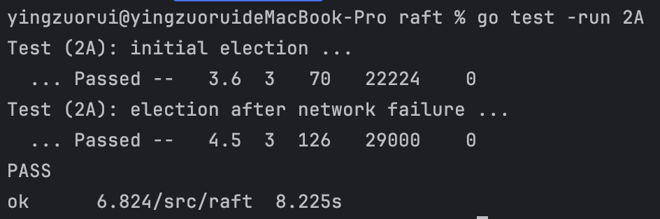
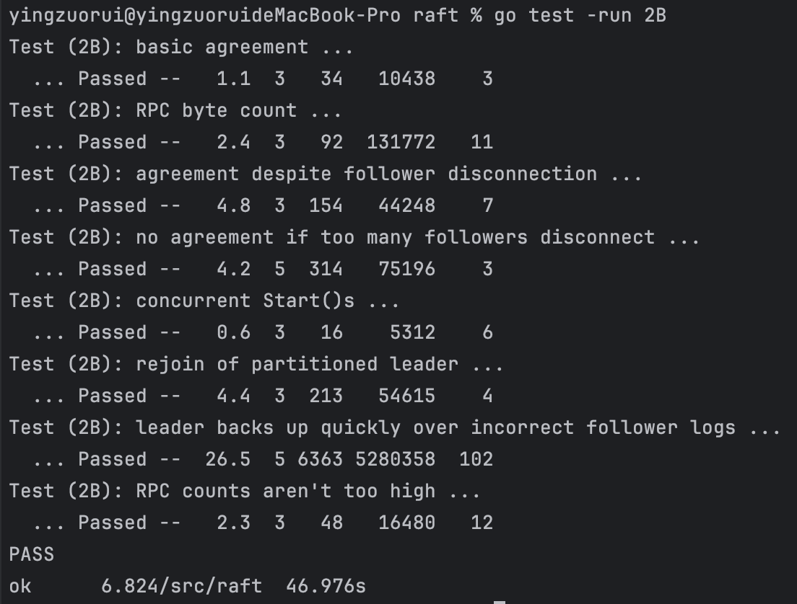

6.824 Lab 记录
====
Lab1 完成
------- 

Lab2A 完成
-------

Lab2B 完成
-------

Lab2B写了很久，感觉还是有疏漏，最后debug靠打补丁过了所有test 
1.不论什么情况，发现本节点或发消息的节点currentTerm过期了，必须要求其立刻更新currentTerm，不然会导致一直选不出来leader 
2.一个节点成为领导者时，需要立刻进行初始化：nextIndex和matchIndex 
nextIndex设置为领导者的日志中的最后一条日志的索引+1。这意味着领导者将从这个索引开始尝试向跟随者发送日志条目 
matchIndex设置为0，领导者不确定跟随者已复制的日志的最高索引。这个值将在成功复制日志条目后进行更新。